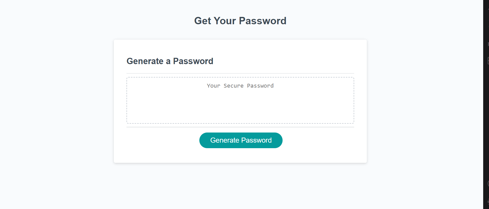
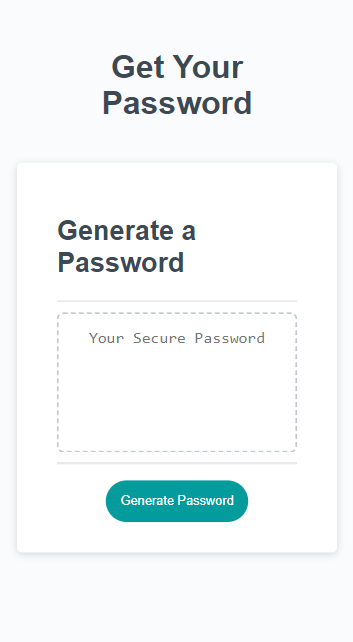

# Get Your Password 🔐

## Deployed Website Link
https://digitallyalex.github.io/get-your-password/

## Description
A simple password generator built with JavaScript. 

This web application provides the ability to create a secure password by simply selecting the necessary length and character types.

Creating the functionality of this password generator was a very stimulating and rewarding experience, and feel it helped me further my knowledge and understanding of JavaScript concepts such as array methods, for loops and conditionals.

## Installation
N/A

## Usage

When clicking on 'Generate Password', a pop-up window will appear, prompting the user to input the preferred password length, between 8 and 128 characters.

Then, the user will have to click 'OK' for each type of character they need to have included in the password, choosing among lowercase, uppercase, numeric, and special characters. 

In the case that the password length is invalid, or that the user doesn't select any type of characters, an alert will appear, and the process will start from scratch.

;

The application can also be accessed via mobile.

## Credits
Overall instruction and provision of necessary materials for this project from the EdX Front-End Web Development Bootcamp instructor and teaching assistants (Oct2023 Cohort). 

Special thanks to my EdX academic tutor Sandra Smith for her support in helping me understand the concepts I needed to implement in this project.

Additionally, a few resources and tutorials were very helpful in guiding me towards the completion of this task and learning JavaScript overall:
- On JavaScript window prompt(): https://www.w3schools.com/jsref/met_win_prompt.asp
- On JavaScript window confirm(): https://www.w3schools.com/jsref/met_win_confirm.asp
- On JavaScript Random: https://www.w3schools.com/js/js_random.asp

Badges at the bottom of this README file were listed with the help of the following repository: https://github.com/Ileriayo/markdown-badges

## License
MIT License

Copyright (c) 2023 Alexandra Asanache

Permission is hereby granted, free of charge, to any person obtaining a copy of this software and associated documentation files (the "Software"), to deal in the Software without restriction, including without limitation the rights to use, copy, modify, merge, publish, distribute, sublicense, and/or sell copies of the Software, and to permit persons to whom the Software is furnished to do so, subject to the following conditions:

The above copyright notice and this permission notice shall be included in all copies or substantial portions of the Software.

THE SOFTWARE IS PROVIDED "AS IS", WITHOUT WARRANTY OF ANY KIND, EXPRESS OR IMPLIED, INCLUDING BUT NOT LIMITED TO THE WARRANTIES OF MERCHANTABILITY, FITNESS FOR A PARTICULAR PURPOSE AND NONINFRINGEMENT. IN NO EVENT SHALL THE AUTHORS OR COPYRIGHT HOLDERS BE LIABLE FOR ANY CLAIM, DAMAGES OR OTHER LIABILITY, WHETHER IN AN ACTION OF CONTRACT, TORT OR OTHERWISE, ARISING FROM, OUT OF OR IN CONNECTION WITH THE SOFTWARE OR THE USE OR OTHER DEALINGS IN THE SOFTWARE.

## Badges
  	  